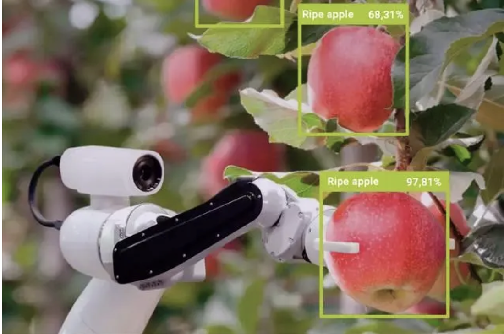
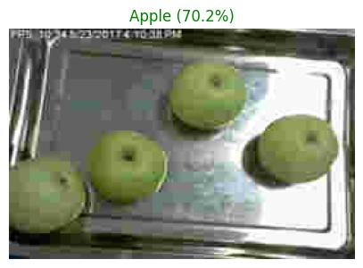
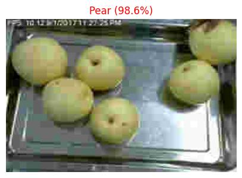
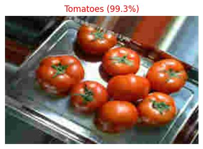

# 🍎 Intelligent Apple Recognition System | 苹果智能识别系统

A computer vision and deep learning-based system for identifying, classifying, and evaluating apples in orchard images.  
基于计算机视觉与深度学习的苹果图像识别系统，实现苹果计数、定位、成熟度评估与品质识别。


<!-- Banner -->
<div align="center">
  
</div>

<!-- Badges -->
<div align="center">
  
  
  
</div>


---

---

## 🗂️ Project Overview | 项目概览

This project presents a full-stack image recognition system for apples, combining classical computer vision techniques and deep neural networks. The pipeline is designed to support fruit-picking robots by enabling accurate, automated analysis of apples in orchard images.


We focus on five core tasks:

- 🍏 Counting and locating apples using OpenCV and adaptive B-spline contour fitting 
- 🔥 Analyzing spatial distribution of apples with coordinate mapping and heatmaps
- 🧠 Classifying ripeness via a custom-built Convolutional Neural Network (CNN)
- 📊 Estimating mass based on 2D contour area and Monte Carlo simulation 
- 🏷️ Classifying apples among other fruits using a ResNet-50 model with transfer learning

本项目构建了一套完整的苹果图像识别与分析流程，结合了传统图像处理与深度学习算法，旨在辅助采摘机器人实现苹果的自动检测与分类识别。


我们的研究任务包括：

利用 OpenCV 和自适应 B 样条轮廓提取实现苹果的计数与定位

建立坐标系统并绘制热力图以分析苹果的空间密度分布

构建 CNN 模型，对苹果成熟度进行自动判别

基于图像面积与蒙特卡洛方法估算苹果质量

基于 ResNet-50 的迁移学习模型实现多种果实分类识别

---


## 📦 Installation | 安装方式  

```bash
git clone https://github.com/Yingurt001/Intelligent-Apple-Recognition.git
cd Intelligent-Apple-Recognition
pip install -r requirements.txt
```
---
##  Dataset Description | 数据集说明

The project uses image datasets of apples and mixed fruits provided by the 2023 APMCM Problem A.

###  Attachment 1: Apple Orchard Images
- 200 RGB images of harvest-ready apples in natural orchard environments
- Image size: 270 × 180 pixels
- Apples are presented with various occlusion types: leaf, branch, fruit, and mixed occlusion
- Tasks: apple counting, positioning, maturity estimation, and mass estimation

###  Attachment 2: Labeled Fruit Images
- 20,705 labeled images of five fruit types: apple, carambola, pear, plum, tomato
- Each image has a size of 270 × 180 pixels
- Used for training a fruit classifier model (e.g., ResNet50)

###  Attachment 3: Unlabeled Fruit Images
- 20,705 unlabeled fruit images with identical format to Attachment 2
- The task is to classify and identify apples among them using the trained model


项目使用了 2023 APMCM A 题所提供的苹果图像与混合果蔬图像数据集：

### 附件1：果园苹果图像
- 共 200 张 RGB 图像，拍摄于自然果园环境
- 图像尺寸：270 × 180 像素
- 苹果存在多种遮挡情况：叶片遮挡、枝干遮挡、果实遮挡与混合遮挡
- 用于执行苹果计数、定位、成熟度与质量估计等任务

### 附件2：标注水果图像
- 共 20705 张已标注的果蔬图像，包括苹果、杨桃、梨、李子和番茄共五类
- 每张图像大小为 270 × 180 像素
- 用于训练水果识别模型，如 ResNet50 网络

### 附件3：未标注水果图像
- 共 20705 张与附件2相同格式的未标注图像
- 目标为使用训练好的模型识别其中的苹果图像
✅

##  Implementation of Research Objectives | 研究目标实现过程
### 🍏 Counting and locating apples
In natural orchard environments, apples in images often appear partially occluded, overlapped, or affected by uneven lighting and cluttered backgrounds. These challenges make traditional image processing methods—such as simple color thresholding or edge detection—insufficiently robust for accurate fruit counting. To address this, we designed and implemented a reliable apple counting pipeline that integrates image preprocessing, morphological operations, segmentation algorithms, and curve fitting techniques to enhance precision and consistency.

We began by converting raw images to grayscale and applying Gaussian filtering to smooth edges and suppress noise. Next, we performed adaptive thresholding to binarize the image based on local luminance, which ensures better segmentation under varying lighting conditions. To separate adjacent or touching apples, we applied morphological operations (erosion and dilation) and used the watershed algorithm based on distance transformation, which proved effective in isolating individual apple contours.

For contour fitting, we employed non-uniform B-spline curves to handle irregular fruit boundaries and produce smooth, accurate approximations. We then calculated the minimum enclosing circle for each contour to estimate the size and position of potential apples. Only those contours that satisfied geometric constraints were counted as valid detections.

Through this approach, we successfully identified a total of 1,657 apples across 200 test images. The resulting count distribution was visualized through histograms and laid a solid foundation for subsequent tasks such as spatial localization and mass estimation.


在自然果园环境下，图像中的苹果常常存在遮挡、重叠、光照不均、背景杂乱等情况，导致传统基于颜色或边缘检测的图像处理方法在识别果实时表现不稳定。为了解决这一问题，我们设计并实现了一套稳健的图像计数流程，结合了图像预处理、形态学操作、分割算法与曲线拟合技术，提升了计数精度与稳定性。

具体而言，首先对原始图像进行灰度化处理，并使用高斯滤波以平滑图像、去除噪声。随后，我们采用自适应阈值方法对图像进行局部二值化，使其更能适应不同光照区域下的图像特征。为了进一步消除伪边缘和分离粘连果实，我们引入了腐蚀与膨胀操作，以及基于距离变换的分水岭算法，从而有效分割出每个苹果的轮廓。

在轮廓提取阶段，为克服苹果边缘复杂、局部不规则等问题，我们采用了非均匀 B 样条曲线对轮廓进行平滑拟合，使其更贴近果实真实形状。随后，我们计算每个轮廓的最小外接圆，借此估算每个苹果的位置与尺寸，并以此作为有效果实的统计依据。

通过这一流程，我们在 200 张测试图像中共识别出 1657 个苹果，构建了完整的计数分布图，并为后续的空间定位、质量估计等任务打下了坚实的基础。


---
## 🧱 Project Structure | 项目结构

```bash
├── Apple CNN/                           # CNN-based fruit classification (EffNetB0)
│   ├── fruit_classifier_effnetb0.h5     # Trained classification model
│   ├── Test.ipynb                       # Inference and visualization notebook
│   ├── Test/                            # Test images
│   └── Prediction_Results/             # Output predictions with labels
├── Assets/                              # Project illustration images
│   ├── Banner_1.png
│   ├── 3_comparison.jpg
│   └── ...
├── Code Attachment/                     # Code files and references for Q3/Q4
│   ├── q3_process.ipynb
│   ├── apple_counts.xlsx
│   ├── 标记坐标.ipynb
│   ├── 蒙特卡洛.xlsx
│   └── ...
├── Data/                                # Official APMCM datasets
│   ├── Attachment 1/                    # Orchard apple images
│   ├── Attachment 2/                    # Labeled fruit dataset (5 categories)
│   ├── Attachment 3/                    # Unlabeled fruit dataset
│   └── Archive.zip
├── Demo/                                # One-stop notebook demo and attachments
│   ├── Code_ALL.ipynb
│   ├── Attachment_1/
│   ├── Attachment_2/
│   └── Q2 Results/
├── notebooks/                           # Q1 main analysis pipeline
│   ├── 1_resnet50_fruit_classification.ipynb  # Fruit type classification (ResNet50)
│   ├── 2_count_location.ipynb                  # Apple counting & localization
│   ├── 3_location_scatter_heatmap.ipynb        # Spatial distribution analysis
│   ├── 4_maturity_cnn.ipynb                    # Maturity classification (CNN)
│   ├── 5_mass_montecarlo.ipynb                 # Mass estimation via simulation
│   ├── README_Q1.md
│   └── results/
├── Results/                             # Final results by task
│   ├── Q1_results/
│   ├── Q2 Results/
│   ├── Q3 Results/
│   └── Q4 Results/
├── Results_detail/                      # Augmented versions of prediction results
│   ├── Attachment_2_RedBoost/
│   ├── Attachment_3_Gamma/
│   ├── Final_output_Sharpen/
│   ├── LAB.ipynb
│   ├── apple_counts_summary_v2_v2.csv
│   └── ...
├── requirements.txt                     # Python dependencies
├── environment.yml                      # Conda environment config
├── LICENSE
├── README.md

```
<h3>Result</h3>

<p align="center">
  
  
</p>

<p align="center">
  
</p>

---

### Visual Classification Results | 分类预测可视化展示

We present visual examples of fruit classification using our trained model. Each prediction image shows the top-1 class label and confidence score.

以下展示模型对不同果实（苹果、梨、番茄）的分类预测结果，可视化模型识别效果与准确性。

<p align="center">
  
  
  
</p>

<p align="center">
  <em>Figure: Sample predictions from the classification model.</em>
</p>


 
### 👨‍💻 Project Maintainers
Thanks goes to these wonderful people:
<table>
  <tr>
    <td align="center">
      <a href="https://github.com/Yingurt001">
        
        <br />
        <sub><b>Ying Zhang</b></sub>
      </a>
    </td>
    <td align="center">
      <a href="https://github.com/Alex-TtTT">
        
        <br />
        <sub><b>Alex Hua</b></sub>
      </a>
    </td>
    <td align="center">
      <a href="https://github.com/Lychee-1013z">
        
        <br />
        <sub><b>Yuzhi Zheng</b></sub>
      </a>
    </td>
  </tr>
</table>


## Contributions|致谢

Author: Ying Zhang, Tianhao Hua, Yuzhi Zheng

GitHub: @Yingurt001, @Alex-TtTT, @Lychee-1013z

Email: millionyogurt@gmail.com,
       lychee1013z@gmail.com
       Alex.o.0@outlook.com

欢迎 star / fork 本项目，也欢迎提出改进建议与合作 🙌
